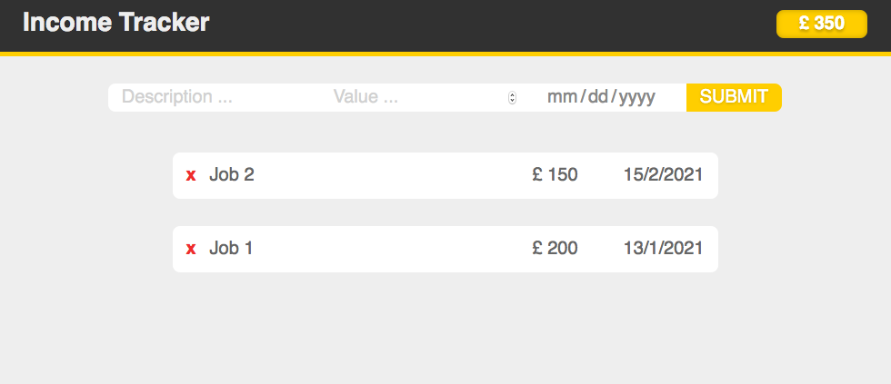
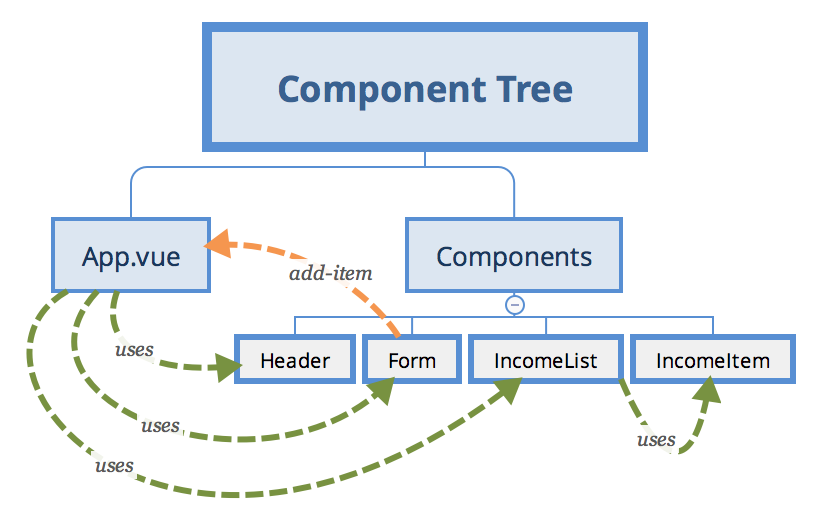

# Vue Income Tracker
This project is based on [Tyler Potts' Youtube tutorial on Vue 3](https://www.youtube.com/watch?v=AjV7k7t78Ik). Notice that the master branch contains some improvements, such as using `reduce()` to sum totals. 

## Project Overview

### Main Screen



This is a single page project. The main screen features a header and a total income conter on the top of the page, followed by the input values and the income list. Notice that the `x` before the income description does not really remove the income.

## Views and Components Overview



Different from most projects so far, this uses one single _View_ - the `App.vue`. Therefore, the tree consists of components that are aggregated on the `App.vue` _View_.

* `App.vue` groups visible components in the main page. It also keeps the data structure and the `addIncome` method for adding new incomes;

* `Header.vue` just shows the total sum of all incomes;

* `Form.vue` handles data input, by sending the data via the `add-income` event;

* `IncomeList.vue` receives data structure and iterate over it, calling the `IncomeItem` to show individual data;

* `IncomeItem.vue` just formats the date and show values.

## Dependencies
The master branch does not feature any dependency.

## Project Setup
```
yarn install
```

```
yarn serve
```

